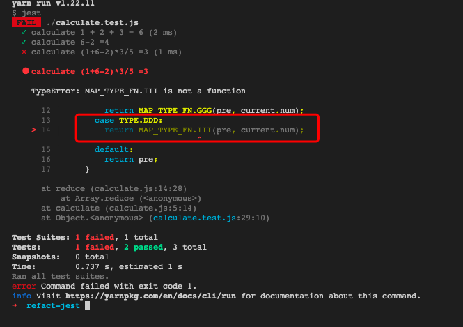

# 重构 - 构筑测试体系之单元测试

## 一、价值

* 通过程序检测代码质量，降低代码bug率
* 缩短bug定位时间
* 边缘自测
* 方便迭代重构

## 二、价值体现

**案例代码**

```js
const TYPE = {
  AAA: "AAA",
  BBB: "BBB",
  CCC: "CCC",
  DDD: "DDD",
};
const MAP_TYPE_FN = {
  EEE: (a, b) => a + b,
  FFF: (a, b) => a - b,
  GGG: (a, b) => a * b,
  HHH: (a, b) => a / b,
};
function calculate(arr = []) {
  return arr.reduce((pre, current) => {
    switch (current.type) {
      case TYPE.AAA:
        return MAP_TYPE_FN.EEE(pre, current.num);
      case TYPE.BBB:
        return MAP_TYPE_FN.FFF(pre, current.num);
      case TYPE.CCC:
        return MAP_TYPE_FN.GGG(pre, current.num);
      case TYPE.DDD:
        return MAP_TYPE_FN.III(pre, current.num);
      default:
        return pre;
    }
  }, 0);
}
```

* 提高代码质量&缩短bug定位时间

上面的代码，没有语义化，在阅读起来，比较吃力，书写的时候，很有可能将代码编写错误，导致代码在运行时的时候就抛出异常，导致程序奔溃

如果通过单元测试，便可以快速定位异常


* 方便迭代重构

看到上面案例代码，第一眼，这都是写啥呀，一点都不予以，各种变量，各种映射关系，阅读起来非常吃力，必须将所有的代码通读一遍，才知道里面的逻辑

但是如果看到测试用例的话，就可以快速了解代码的用途了

```js
const { calculate } = require("./calculate");
const { TYPE } = require("./type");

test("计算 1 + 2 + 3 = 6", () => {
  const arr = [
    { type: TYPE.AAA, num: 1 },
    { type: TYPE.AAA, num: 2 },
    { type: TYPE.AAA, num: 3 },
  ];
  expect(calculate(arr)).toBe(6);
});

test("计算 6-2 =4", () => {
  const arr = [
    { type: TYPE.AAA, num: 6 },
    { type: TYPE.BBB, num: 2 },
  ];
  expect(calculate(arr)).toBe(4);
});

test("计算 (1+6-2)*3/5 =3", () => {
  const arr = [
    { type: TYPE.AAA, num: 1 },
    { type: TYPE.AAA, num: 6 },
    { type: TYPE.BBB, num: 2 },
    { type: TYPE.CCC, num: 3 },
    { type: TYPE.DDD, num: 5 },
  ];
  expect(calculate(arr)).toBe(3);
});
```

## 三、哪些项目适用

1. 公共库类的开发维护
2. 中长期项目的迭代/重构
3. 引用了不可控的第三方依赖

## 四、总结

写测试代码，短时间来说，是一个比较耗时间的工作，无形中给自己增加了许多工作量，但是长远来看，是一个可以提高开发效率和质量的。正如上面的案例，一个比较完善的测试代码，可以提高代码的质量，bug快速定位，阅读性比较强等优点。

## 参考

* [《重构》](https://item.jd.com/12584498.html)
* [试试前端自动化测试](https://juejin.cn/post/6844904194600599560#heading-3)
